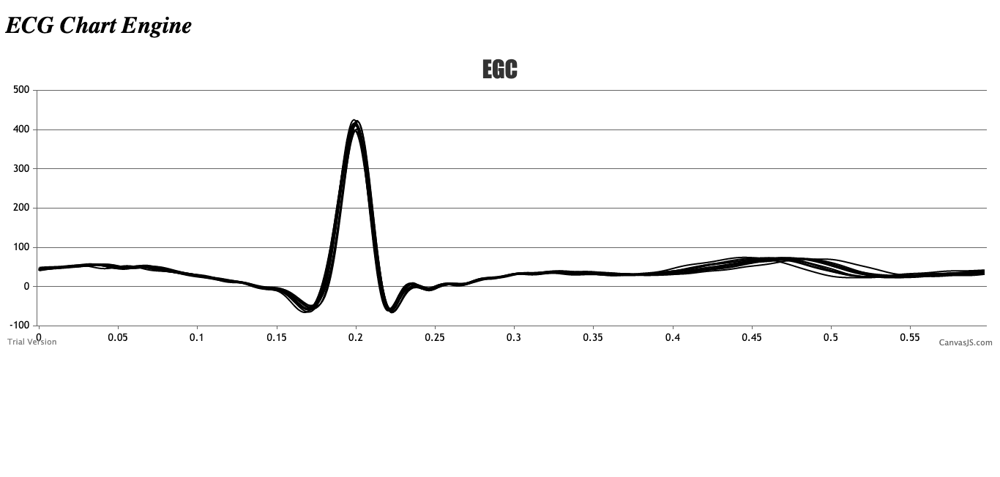

# Projeto de ECG remoto



Aqui voce encontra o codigo fonte do servidor (back-end) do projeto _ECG remoto_. _ECG remoto_ eh um projeto de pesquisa com apoio do [IFSul](www.ifsul.edu.br)
 
Este servidor esta preparado para receber dados de exames de Eletrocardiograma (ECG) enviados de dispositivos com capacidade de coneccao a internet.
O hardware para realizacao do exame e envio dos dados coletados esta em desenvolvimento.

O servidor esta hospedado em [http://ecgremoto.herokuapp.com/](http://ecgremoto.herokuapp.com/).

A visualizacao dos dados do servidor esta disponivel no nosso front-end 
O front-end esta em [http://tsi.charqueadas.ifsul.edu.br/~ecgremoto/](http://tsi.charqueadas.ifsul.edu.br/~ecgremoto/) - versao em desenvolvimento

## Preliminares


Voce tem 2 formas de utilizar o servidor deste repositorio
 1. **Full Local** - Configurando todo o ambiente em sua maquina local. Nesta opcao voce vai precisar instalar todas as ferramentas e fazer o download deste repositorio. 
 2. **Docker Version** - Montando o ambiente pronto e sem fazer download. Nesta opcao voce so precisa instalar o Docker e montar a imagem do ambiente pronto diretamente da nuvem, sem fazer download.

## Requisitos
#### Full Local 
- NodeJS [https://nodejs.org/en/](https://nodejs.org/en/)
- Python 3.x [https://www.python.org/downloads/](https://www.python.org/downloads/)
- Biblioteca Python biosppy
- Repositorio ECG Remoto

#### Docker Version
- Docker [https://docs.docker.com/](https://docs.docker.com/)


## Instalação
#### Full Local 
1. Faca download deste repositorio
```sh
git clone https://github.com/MarceloSkank/ECGRemote .
```
2. Instale o pacote yarn do NodeJS 
```sh
npm install --global yarn
cd EcgRemote/
yarn install
```
3. Instale o BiosSPy por meio do pip 
```sh
curl https://bootstrap.pypa.io/get-pip.py -o get-pip.py
python get-pip.py
pip install biosspy
```

#### Docker Version
Voce so precisa fazer o "puxar" as configuracoes do container diretamente do registro `marcelojanke/ecg_remoto` que esta na nuvem.
```sh
sudo docker pull marcelojanke/ecg_remoto
```

## Utilizacao
Apos o set-up do ambiente escolhido, voce precisa destes comandos para executar
#### Full Local 
No diretorio `ECGRemote` execute:
```sh
yarn dev
```
Visualize o servidor rodando no navegador:
```sh
http://localhost:3333/
```

#### Docker Version
1. Escolha um nome para ***SEU_CONTAINER*** e execute a linha abaixo:
```sh
sudo docker run -d -p 3333:3333 marcelojanke/ecg_remoto -name SEU_CONTAINER
```
2. Verifique se ***SEU_CONTAINER*** esta na lista de containers e se esta executando
```sh
sudo docker ps -a
```
3. Visualize o servidor rodando no navegador
```sh
http://seu_numero_ip:3333/
```
4. Apos o uso do seu container, pare a execucao dos containers e remova da lista de containers 
```sh
sudo docker container stop SEU_CONTAINER
sudo docker container rm SEU_CONTAINER
```

## Rotas
| Rota               | Metodo | Descricao                                                                                                  |
|--------------------|--------|------------------------------------------------------------------------------------------------------------|
| `/demo`            | POST   | Rota para testar requisicoes POST. Retorna `{"res":200}` em caso de sucesso.                               |
| `/savelog`         | POST   | Salva as requisicoes no formato `{data:SEU_DADO}`                                                          |
| `/`                | GET    | Rota para testar requisicoes GET. Retorna `{"res":200}` em caso de sucesso                                 |
| `/see`             | GET    | Lista todas requisicoes POST na rota `/savelog`                                                            |
| `/seetxt`          | GET    | Lista todas requisicoes ja realizadas no servidor                                                          |
| `/gettxt`          | GET    | Faz o download do txt com todas as requisicoes feitas em `saveReq`                                         |
| `/rotaAlternativa` | GET    | Alternativa para o POST em /savelog. Exemplo: http://ecgremoto.herokuapp.com/rotaAlternativa?data=SEU_DADO |
| `/remove`          | DELETE | deleta todas os dados armazenados gerado pela rota `/savelog`                                              |
