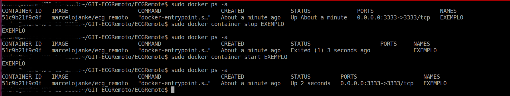
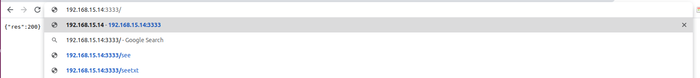

# Projeto de ECG remoto


Aqui voce encontra o codigo fonte do servidor (back-end) do projeto _ECG remoto_. _ECG remoto_ eh um projeto de pesquisa com apoio do [IFSul](www.ifsul.edu.br)
 
Este servidor esta preparado para receber dados de exames de Eletrocardiograma (ECG) enviados de dispositivos com capacidade de coneccao a internet.
O hardware para realizacao do exame e envio dos dados coletados esta em desenvolvimento.

O servidor esta hospedado em [https://ecgremote.herokuapp.com](https://ecgremote.herokuapp.com/).

A visualizacao dos dados do servidor esta disponivel no nosso front-end 
O front-end esta em [http://tsi.charqueadas.ifsul.edu.br/~ecgremoto/](http://tsi.charqueadas.ifsul.edu.br/~ecgremoto/) - versao em desenvolvimento

## Preliminares


Voce tem 2 formas de utilizar o servidor deste repositorio
 1. **Full Local** - Configurando todo o ambiente em sua maquina local. Nesta opcao voce vai precisar instalar todas as ferramentas e fazer o download deste repositorio. 
 2. **Docker Version** - Montando o ambiente pronto e sem fazer download. Nesta opcao voce so precisa instalar o Docker e montar a imagem do ambiente pronto diretamente da nuvem, sem fazer download.

## Requisitos
#### Full Local 
- NodeJS [https://nodejs.org/en/](https://nodejs.org/en/)
- Python 3.x [https://www.python.org/downloads/](https://www.python.org/downloads/)
- yarn [https://yarnpkg.com/package/download](https://yarnpkg.com/package/download)
- Biblioteca Python biosppy
- Aplicação ECG Remoto (este repositório)

#### Docker Version
- Docker [https://docs.docker.com/](https://docs.docker.com/)

#### Heroku CLI
- Heroku CLI [https://devcenter.heroku.com/articles/heroku-cli](https://devcenter.heroku.com/articles/heroku-cli)


## Instalação
#### Full Local 
1. Faca download deste repositorio
```sh
git clone https://github.com/MarceloSkank/ECGRemote .
```
2. Instale o pacote yarn do NodeJS 
```sh
npm install --global yarn
cd EcgRemote/
yarn install
```
3. Instale o BiosSPy e outras bibliotecas nescessarias por meio do pip 
```sh
curl https://bootstrap.pypa.io/get-pip.py -o get-pip.py
python get-pip.py
pip install biosspy
pip install certifi
pip install request
pip install pymongo[srv]
pip install python-dotenv
```

## Utilizacao
Apos o set-up do ambiente escolhido, voce precisa destes comandos para executar
#### Full Local 
No diretorio `ECGRemote` execute:
```sh
yarn dev
```
Visualize o servidor rodando no navegador:
```sh
http://localhost:3366/
```

#### Docker Version
Voce so precisa fazer o "puxar" as configuracoes do container diretamente do registro `marcelojanke/ecg_remoto` que esta na nuvem e escolher um nome para ***SEU_CONTAINER***.
```sh
docker pull marcelojanke/ecg_remoto 
docker run -d -p 3333:3333 --name SEU_CONTAINER marcelojanke/ecg_remoto
```
Caso você precise Criar a imagem para o seu container:
```sh
docker build -t name/aplicacao . 
docker run -d -p 3333:3333 --name SEU_CONTAINER name/aplicacao
```

#### Utilização
1. Verifique se ***SEU_CONTAINER*** esta na lista de containers e se esta executando
```sh
docker ps -a
```
Coluna *STATUS* da figura esta em **Up** quando o container esta executando. *STATUS* **Exited** indica o container parado. 


2. Caso ***SEU_CONTAINER*** esteja na lista e esta parado, voce pode inicializa-lo:
```sh
docker container start SEU_CONTAINER
```
3. Com seu container executando, visualize o servidor rodando no navegador `http://localhost:3333/`



4. Caso ***SEU_CONTAINER*** esteja na lista e executando, voce pode para-lo:
```sh
docker container stop SEU_CONTAINER
```
5. Voce pode remover ***SEU_CONTAINER*** da lista de containers: 
```sh
docker container stop SEU_CONTAINER
docker container rm SEU_CONTAINER
```

## Rotas
| Rota               | Metodo | Descricao                                                                                                  |
|--------------------|--------|------------------------------------------------------------------------------------------------------------|
| `/savelog`         | POST   | Salva as requisicoes no formato `{data:SEU_DADO}`                                                          |
| `/`                | GET    | Rota para testar requisicoes GET. Retorna `{"res":200}` em caso de sucesso                                 |
| `/see`             | GET    | Lista todas requisicoes POST na rota `/savelog`                                                            |
| `/seetxt`          | GET    | Lista todas requisicoes ja realizadas no servidor                                                          |
| `/rotaAlternativa` | GET    | Alternativa para o POST em /savelog. Exemplo: http://ecgremoto.herokuapp.com/rotaAlternativa?data=SEU_DADO |
| `/remove`          | DELETE | deleta todas os dados armazenados gerado pela rota `/savelog`                                              |
| `/save_exam`       | POST   | Salva os exames no formato `{sampling_rate": 360,"resolution": 145,"labels": ["ECG"],"data": [968,870,1110,4567],	"userId": "Fulano de tal",	"title": "Ola",type": "1 NSR"}`
| `/:user/exams/:id/remove` |DELETE| Remove o Exame pelo ID
|`/:user/exams/update/:id`| GET | Faz um Update do exame pelo ID (utilizado para acresentar mais dados de ecg) exemplo: http://ecgremoto.herokuapp.com/{nome}/exams/update/{id}?data=1234 
|`/list_all`        | GET   | Lista todos os exames
|`/:user/exams/:id` | GET | Acessa o exame Pelo ID|
|`/update_exam/:id` |POST| Faz a mesma coisa que a rota `/:user/exams/update/:id`, porem é ustilizada com o metodo POST (utilizado para acresentar mais dados de ecg), exemplo: {"data":[1111, 952, 988]}. 

### Comunicação entre Servidor <-> Hardware

#### Heroku CLI
Para fazer Deploy do seu container no Heroku.

1. Faça Login na sua conta heroku
```sh
heroku login
```

2. Faça Login também no cnotainer Heroku.
```sh
heroku container:login
```

3. Crie uma aplicação e escolha o nome ***name_app***
```sh
heroku create name_app
```

4. Contrua um conteinaer utilizando o docker no resgistro do heroku e de um *push*.
```sh
docker build -t registry.heroku.com/name_app/web 
docker push registry.heroku.com/name_app/web
```

4. usando o herou e um release no seu app e depois abra.
```sh
heroku container:release web -a name_app
heroku open -a name_app
```
